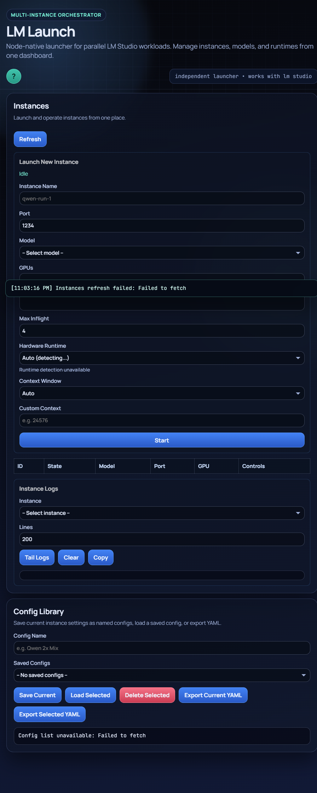

# LM Launch

LM Launch is a Node.js control plane and dashboard for running multiple headless LM Studio instances in parallel on a single host.

This repo runs as a host-native Node deployment.

## Dashboard



## What It Does

- Manage runtime profiles (host, port, GPU selection)
- Launch/stop/kill/drain LM Studio instances
- Select model per launched instance
- Expose ready-only manifest for external routing
- Show logs and operator actions in a lightweight dashboard
- Discover models and GPUs through the host bridge

## Architecture (Node Native)

1. API + dashboard service (`apps/api`) on port `8081`
2. Host bridge (`apps/host-bridge`) on port `8090`

## Dependencies

Required:

- Node.js 20+
- LM Studio CLI/runtime (`lms`) available on host

If you want GPU visibility in LM Launch:

- NVIDIA driver installed on host
- `nvidia-smi` available on host path

## Quick Start (Native)

1. Install dependencies:

```bash
npm run install:native
```

If running from an SMB/GVFS mount, this command already disables npm bin symlinks for compatibility.

2. Start all services:

```bash
npm run start:native
```

3. Open dashboard:

- http://localhost:8081

4. API endpoint:

- http://localhost:8081

## Development

Run all services with watch-enabled API and bridge:

```bash
npm run dev:native
```

Run individual services:

```bash
npm run start:bridge
npm run start:api
```

## Environment Variables

### Shared

- `API_AUTH_TOKEN` (optional; when unset, API auth is disabled)
- `BRIDGE_AUTH_TOKEN` (optional; when unset, bridge auth is disabled)

### API

- `PORT` (default `8081`)
- `BRIDGE_URL` (default `http://127.0.0.1:8090`)
- `STATE_FILE` (default `./data/state.json`)
- `SHARED_CONFIG_FILE` (default `./data/shared-config.yaml`)

### Bridge

- `BRIDGE_PORT` (default `8090`)
- `LOG_LINES_DEFAULT` (default `200`)
- `READINESS_POLL_MS` (default `2000`)
- `READINESS_HTTP_TIMEOUT_MS` (default `5000`)
- `SMOKE_CHECK_ENABLED` (`true` by default)

## LM Studio Notes

Expected host commands:

```bash
lms daemon up
lms server start --port 1234
```

LM Launch starts/stops instances through the bridge service and tracks readiness per instance.

## GPU Diagnostics

If GPU detection cannot run, `/v1/system/gpus` returns:

- `data: []`
- `warning`
- `diagnostics` with checks and remediation steps

This allows non-GPU dev machines to run cleanly while still giving actionable server diagnostics.

## API Help

- Dashboard Help button opens API `/help`
- `/help` redirects to this README by default

## License

MIT
