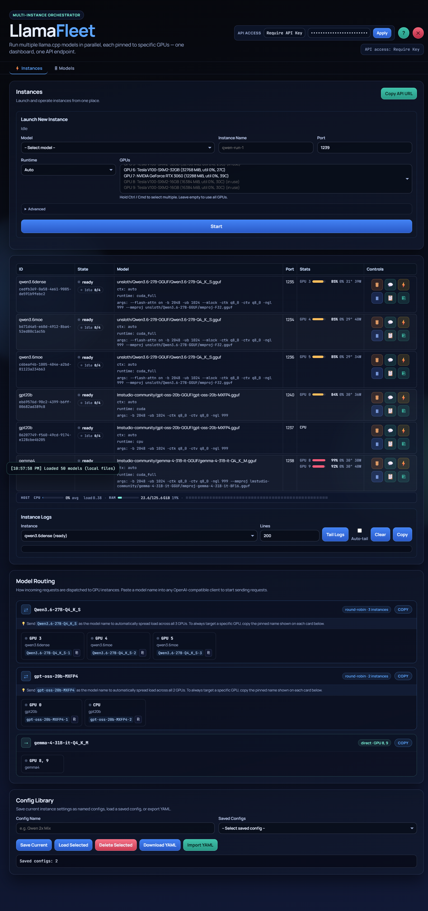
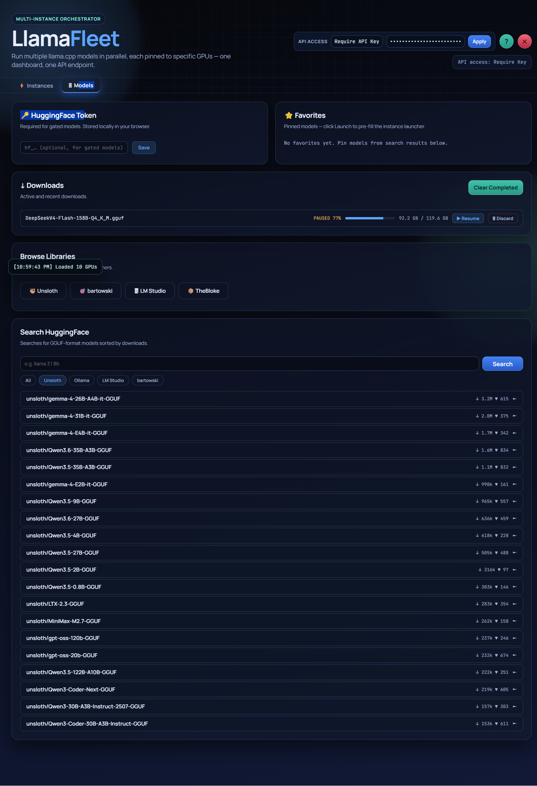

# LlamaFleet

**Run multiple llama.cpp instances in parallel — GPU-accelerated, CPU-only, or any heterogeneous mix — from one browser dashboard.**

LlamaFleet is a lightweight Node.js control plane and operator dashboard for multi-instance llama.cpp deployments. It partitions a multi-GPU machine — assigning specific GPUs to specific models — and manages the full lifecycle of each instance (launch, reload, drain, restart, remove) from a single browser UI without touching a terminal.

Each instance runs as an independent `llama-server` process with its own context window, queue limit, TTL, and GPU subset. LlamaFleet tracks state, catches crashes, and auto-restarts instances with configurable backoff.

Every instance is reachable through a single **OpenAI-compatible API** at `http://host:8081/v1/instances/<id>/proxy/v1/...` — same bearer token, same `/v1/chat/completions` and `/v1/completions` endpoints. A top-level `/v1/chat/completions` endpoint routes by model name with automatic round-robin across instances sharing the same model, so you can set `base_url = http://host:8081/v1` once and let LlamaFleet handle load distribution.

**Key capabilities:**
- Per-instance GPU pinning via `CUDA_VISIBLE_DEVICES` and equivalents for AMD/Intel/Metal
- Headless process management — start, stop, drain, kill, remove from the browser or API
- OpenAI-compatible reverse proxy per instance — all `llama-server` processes bind to `127.0.0.1`; one port for everything
- **Named model routing with round-robin pool support** — `POST /v1/chat/completions` with `"model": "MyModel"` round-robins across all running instances of that model; append `-1`, `-2`, etc. to pin to a specific instance (e.g. `"model": "MyModel-1"`). `GET /v1/models` returns both the pool entry and each pinned alias so any OpenAI client can discover them automatically.
- **Heterogeneous compute pools** — combine GPU-accelerated (NVIDIA/AMD/Intel), CPU-only, and mixed-offload `llama-server` instances in the same round-robin pool under a single model name. Run a fast CUDA instance alongside a CPU fallback, or pool instances across different GPU vendors, and LlamaFleet distributes load across all of them automatically.
- Global bearer token auth for both dashboard and all proxy traffic
- Config profiles — save a model + GPU + context + TTL combination and relaunch in one click
- Auto-restart with configurable backoff on unclean exits
- Periodic health monitoring — instances are polled every 30 s and auto-restarted if unhealthy
- Prometheus scrape endpoint at `GET /metrics` (per-instance + per-GPU telemetry)
- Compact VRAM bars in the GPU column with utilisation %, temperature, and power
- Log viewer with auto-tail and clone-setup action per instance
- Model Routing dashboard section — visual overview of which instances form a round-robin pool vs. solo routes, with one-click copy of each pinned model name

LlamaFleet uses GGUF models via `llama-server` directly — no LM Studio or Ollama required. Works on NVIDIA (including pre-Ampere V100/10xx/20xx), AMD, and CPU.

> **Security note:** LlamaFleet is a **single-tenant control plane** designed for trusted local networks and homelabs. Do not expose port `8081` to the public internet without a reverse proxy and firewall rules. See [SECURITY.md](SECURITY.md) for deployment guidance.

---

## Why LlamaFleet instead of Ollama / LM Studio?

All three tools are built on top of `llama.cpp`, so they share the same hardware support and quantisation formats. The differences are in how much control you get over each running process and how you compose them.

| | LlamaFleet | Ollama | LM Studio |
|---|---|---|---|
| Pass-through `llama-server` flags | ✅ Any flag, edited per instance | ⚠ Subset via `Modelfile` params | ⚠ Subset via GUI/JSON |
| Per-instance GPU pinning | ✅ Explicit `CUDA_VISIBLE_DEVICES` per process | ⚠ Global env var | ⚠ Per-model GPU select (recent versions) |
| Multiple models loaded at once | ✅ Unlimited, independent processes | ✅ Via `OLLAMA_MAX_LOADED_MODELS` | ✅ JIT-loaded |
| Round-robin pooling under one model name | ✅ Built-in across instances | ❌ | ❌ |
| Heterogeneous pools (mix GPU/CPU/runtimes) | ✅ Mix any runtimes under one model name | ❌ | ❌ |
| Any local GGUF | ✅ Scan paths + HF Hub browser | ✅ `FROM ./model.gguf` in Modelfile | ✅ Local files + HF browser |
| Browser dashboard | ✅ | ❌ (3rd-party only) | ❌ Desktop GUI only |
| OpenAI-compatible REST API | ✅ | ✅ | ✅ |
| Headless server / SSH box / systemd | ✅ Designed for it | ✅ | ❌ Desktop app |
| Multi-user auth / RBAC | ❌ Single shared bearer token | ❌ No auth | ❌ No auth |

**The short version:** if you need to carve up a multi-GPU box into several `llama-server` processes with explicit per-process hardware control, and pool them behind a single OpenAI endpoint, LlamaFleet is built for that. If you want a one-command model registry on your laptop, Ollama is simpler. If you want a polished desktop GUI for trying models locally, LM Studio is hard to beat.

---

## In App Screenshots

<table align="center" width="100%"><tr>
<td width="50%" align="left" valign="top">

**Instances &amp; Routing**<br/>
Launch form, running instances with GPU stats, log viewer, and the routing map showing which instances share a round-robin pool.

<a href="docs/screenshot-dashboard.png"></a>

</td>
<td width="50%" align="left" valign="top">

**Model Hub**<br/>
Browse and download GGUF models directly from HuggingFace. Tracks active downloads with resume/discard controls and pins favorites for one-click launch.

<a href="docs/screenshot-models.png"></a>

</td>
</tr></table>

---

## Quick Start (Linux — one line)

```bash
curl -fsSL https://github.com/boringresearchjames/llamafleet/releases/latest/download/install.sh | sudo bash
```

Auto-detects your GPU (NVIDIA/AMD/Vulkan/CPU), installs a matching `llama-server` binary, and sets up the systemd service. After install:

```bash
# Edit your tokens
sudo nano /etc/llamafleet/llamafleet.env

sudo systemctl restart llamafleet
```

Open **http://localhost:8081**.

---

## Quick Start (Manual / Development)

### 1. Prerequisites

- **Node.js 18+**
- **A `llama-server` binary** — download a pre-built binary from the [llama.cpp releases page](https://github.com/ggerganov/llama.cpp/releases) or build from source:
  ```bash
  cmake -B build -DGGML_CUDA=on && cmake --build build --target llama-server -j$(nproc)
  ```

| Platform | Binary to download |
|---|---|
| Linux (NVIDIA, CUDA 12) | `llama-*-bin-linux-x64-cuda-cu12*.zip` |
| Linux (AMD, ROCm) | `llama-*-bin-linux-x64-rocm*.zip` |
| Linux (CPU) | `llama-*-bin-linux-x64-avx2*.zip` |
| Windows (NVIDIA, CUDA 12) | `llama-*-bin-win-cuda-cu12-x64.zip` |
| Windows (CPU / AVX2) | `llama-*-bin-win-avx2-x64.zip` |

### 2. Install

```bash
git clone https://github.com/boringresearchjames/llamafleet.git
cd llamafleet
npm run install:deps
```

### 3. Configure

**Minimum required variables:**

| Variable | Purpose |
|---|---|
| `LLAMA_SERVER_BIN` | Full path to your `llama-server` binary |
| `API_AUTH_TOKEN` | Bearer token for the dashboard and API (omit to disable auth) |
| `BRIDGE_AUTH_TOKEN` | Internal API<->bridge token (omit to disable) |

```bash
# Linux
export LLAMA_SERVER_BIN=/usr/local/bin/llama-server
export API_AUTH_TOKEN=change-me
export BRIDGE_AUTH_TOKEN=change-me
```

```powershell
# Windows (PowerShell)
$env:LLAMA_SERVER_BIN = "C:\Tools\llama\llama-server.exe"
$env:API_AUTH_TOKEN   = "change-me"
$env:BRIDGE_AUTH_TOKEN = "change-me"
```

**MODELS_DIR** — LlamaFleet auto-scans `~/.lmstudio/models`, `~/.ollama/models`, `~/.cache/huggingface/hub`, and `~/unsloth_studio`. Override with:

```bash
export MODELS_DIR=/mnt/nas/models
```

### 4. Run

```bash
npm start
```

Open **http://localhost:8081**.

For watch-mode restarts during development:

```bash
npm run dev
```

---

## API Reference

The full REST API reference is in [`docs/api.md`](docs/api.md).

It is also served live at **`http://localhost:8081/help`** with syntax-highlighted endpoint listings, request/response schemas, and Prometheus metric names.

All endpoints require `Authorization: Bearer <token>` when auth is enabled. Endpoints marked **[admin]** require the server `API_AUTH_TOKEN` specifically.

---

## Architecture

LlamaFleet is two core Node.js services plus an optional bridge router:

- **API + dashboard** (`apps/api`, port `8081`) — serves the browser dashboard and REST API. Owns all state persistence (`state.json`) and config profiles. Authenticates inbound requests via `API_AUTH_TOKEN`.
- **Host bridge** (`apps/host-bridge`, port `8090`) — runs natively on the host and spawns `llama-server` child processes, one per instance. Enforces `CUDA_VISIBLE_DEVICES` and six other device-visibility env vars for GPU pinning. Polls instance readiness and captures GPU telemetry via `nvidia-smi`.
- **Bridge router** (`apps/bridge-router`, optional) — sits between the API and multiple host bridges for multi-host deployments. Configure via `BRIDGE_POOLS_JSON`.

### Systemd deployment (Linux)

```bash
sudo bash scripts/install-systemd.sh
```

- Service unit: `deploy/systemd/llamafleet.service`
- Env template: `deploy/systemd/env/llamafleet.env.example` -> `/etc/llamafleet/llamafleet.env`
- Full runbook: `deploy/systemd/README.md`

---

## Environment Variables

### Shared

| Variable | Default | Description |
|---|---|---|
| `API_AUTH_TOKEN` | *(unset)* | Bearer token for dashboard + API. Unset = auth disabled. |
| `BRIDGE_AUTH_TOKEN` | *(unset)* | Internal API<->bridge token. Unset = bridge auth disabled. |

### API (`apps/api`)

| Variable | Default | Description |
|---|---|---|
| `PORT` | `8081` | API + dashboard listen port |
| `BRIDGE_URL` | `http://127.0.0.1:8090` | URL of the host bridge |
| `STATE_FILE` | `./data/state.json` | Persistent state path |
| `SHARED_CONFIG_FILE` | `./data/shared-config.yaml` | Shared config (profiles, security) |
| `MODELS_DIR` | `~/.lmstudio/models` | Primary directory scanned for `.gguf` files. Also auto-scans `~/.ollama/models`, `~/.cache/huggingface/hub`, `~/unsloth_studio` |
| `LLAMAFLEET_PUBLIC_HOST` | *(unset)* | This machine's IP, used in proxy URLs shown in the dashboard |
| `CORS_ORIGIN` | `*` | Value of `Access-Control-Allow-Origin` |

### Bridge (`apps/host-bridge`)

| Variable | Default | Description |
|---|---|---|
| `BRIDGE_PORT` | `8090` | Bridge listen port |
| `LLAMA_SERVER_BIN` | `llama-server` | Path to the `llama-server` binary |
| `DATA_ROOT` | `./data` | Root directory for logs and instance metadata |
| `LOG_LINES_DEFAULT` | `200` | Default line count for log tail requests |
| `READINESS_POLL_MS` | `2000` | How often to poll instance `/health` during startup |
| `READINESS_HTTP_TIMEOUT_MS` | `5000` | Per-request timeout during readiness polling |
| `GPU_BLEED_MAX_DELTA_MIB` | `256` | Max allowed post-stop VRAM increase before flagging bleed |
| `SMOKE_CHECK_ENABLED` | `false` | Run a test inference after startup to verify the instance responds |
| `STRICT_SMOKE_CHECK` | `false` | Treat a failed smoke check as a fatal startup error |

---

## Background

This started as a practical fix for running a fleet of V100s with LM Studio: VRAM was bleeding between GPUs after model swaps, processes crashed under sustained load, and there was no way to pin a model to specific cards or isolate instances. No existing tool — GUI or headless — managed independent `llama-server` processes per GPU subset from a single control plane. LlamaFleet is that tool.

The GPU isolation problem is particularly relevant for pre-Ampere hardware. vLLM and SGLang require CUDA 11+ with Ampere-class features; older V100s and GTX 10/20 series cards either hit capability gaps or produce incorrect results. llama.cpp supports this hardware generation well, but running multiple instances with correct `CUDA_VISIBLE_DEVICES` per process, log management, readiness polling, and crash recovery is operationally tedious. LlamaFleet wraps all of that.

---

## Network Security

LlamaFleet is designed for **homelab and internal network deployments**. It is not hardened for direct public internet exposure. Follow these recommendations before deploying:

**Always do:**
- Set `API_AUTH_TOKEN` and `BRIDGE_AUTH_TOKEN` to long random strings (32+ hex chars). Without these, the API and dashboard are open to anyone on the network.
- Bind port `8081` to your internal network interface only, not `0.0.0.0`, unless you intend it to be reachable network-wide.
- Keep port `8090` (the host bridge) firewalled — it should only be reachable from the API process on `127.0.0.1`. It has no auth by default.

**If you expose port `8081` beyond your LAN:**
- Put a reverse proxy (nginx, Caddy, Traefik) in front and terminate TLS there. LlamaFleet serves plain HTTP.
- Restrict the path via the proxy if you only want API access (not the dashboard).
- Consider IP allowlisting at the firewall or proxy level.

**Token generation:**
```bash
# Linux / macOS
openssl rand -hex 32

# PowerShell
-join ((1..32) | ForEach-Object { '{0:x2}' -f (Get-Random -Max 256) })
```

**What LlamaFleet does not provide:**
- TLS — use a reverse proxy
- Per-user or per-instance auth — one global token for everything
- Rate limiting — your reverse proxy or firewall should handle this
- Audit logging for individual API calls — only instance lifecycle events are logged

---

## Known Limitations

- **Single-host only** — LlamaFleet manages instances on one machine. A bridge-router component exists for multi-host setups but multi-host is not the primary target.
- **`llama-server` binary required** — LlamaFleet does not bundle or build it. Get a binary from the [llama.cpp releases page](https://github.com/ggerganov/llama.cpp/releases).
- **HF Hub browser** — Download models directly from Hugging Face via the Models tab. Local GGUF files are also auto-scanned from `~/.lmstudio/models`, `~/.ollama/models`, `~/.cache/huggingface/hub`, and `~/unsloth_studio` (or a custom `MODELS_DIR`).
- **No per-instance auth** — Auth is enforced at the proxy layer via the global `API_AUTH_TOKEN`. There is no per-instance key.
- **No speculative decoding or prefix caching** — Pass the relevant `llama-server` flags via `runtimeArgs` if the binary supports them.

## License

MIT
